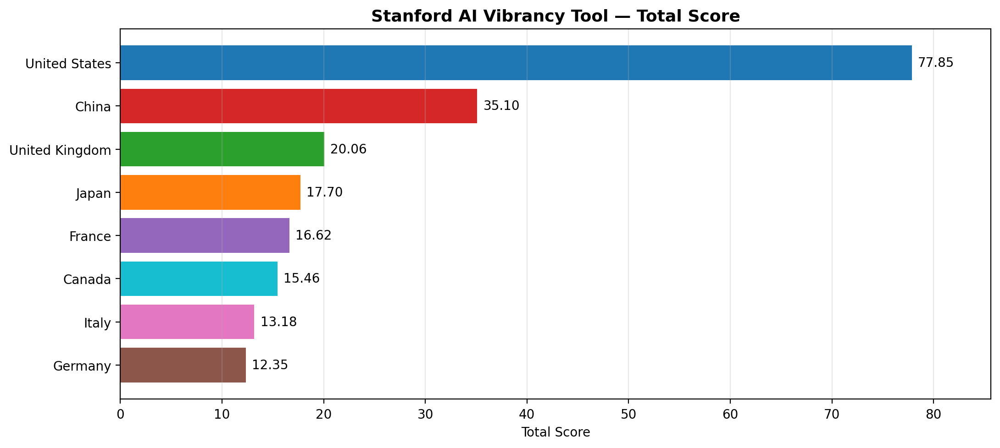
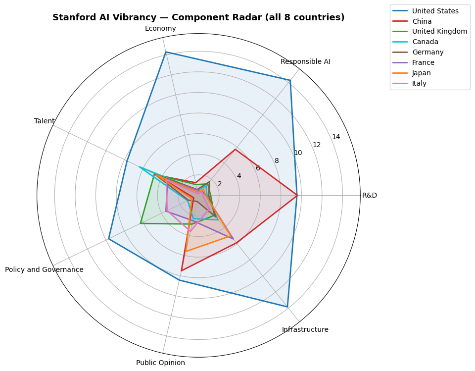
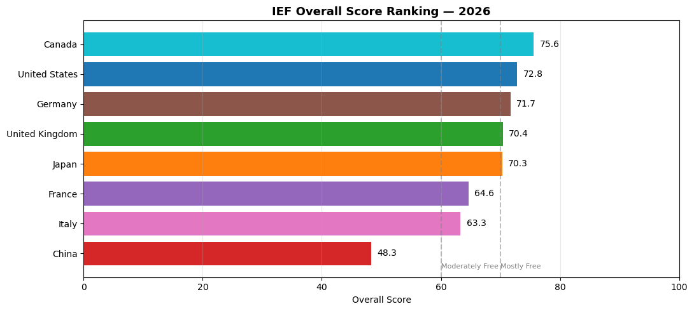
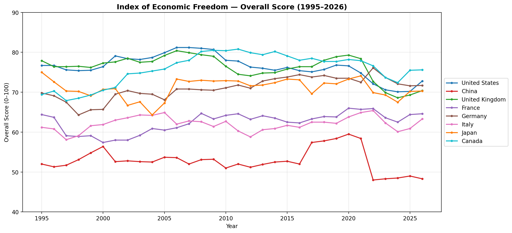
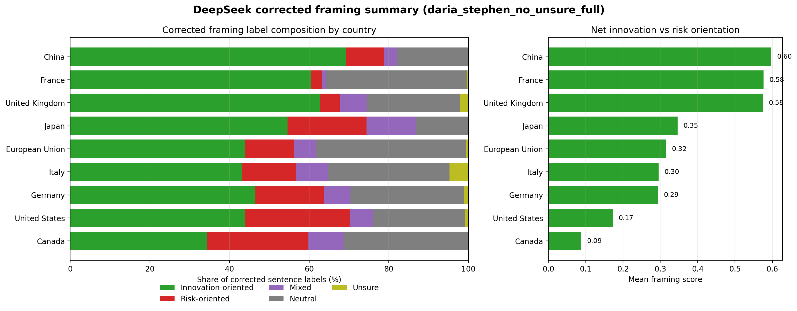
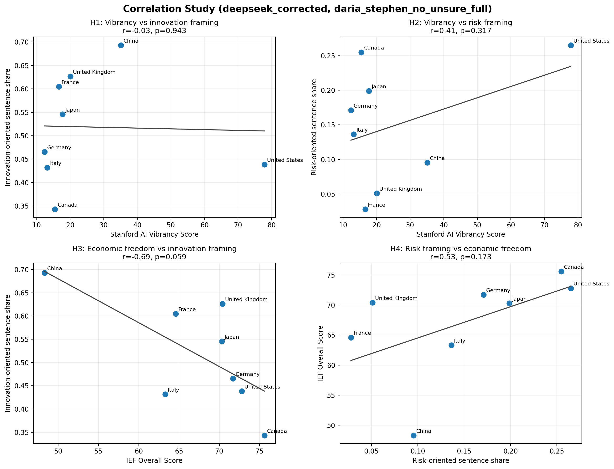
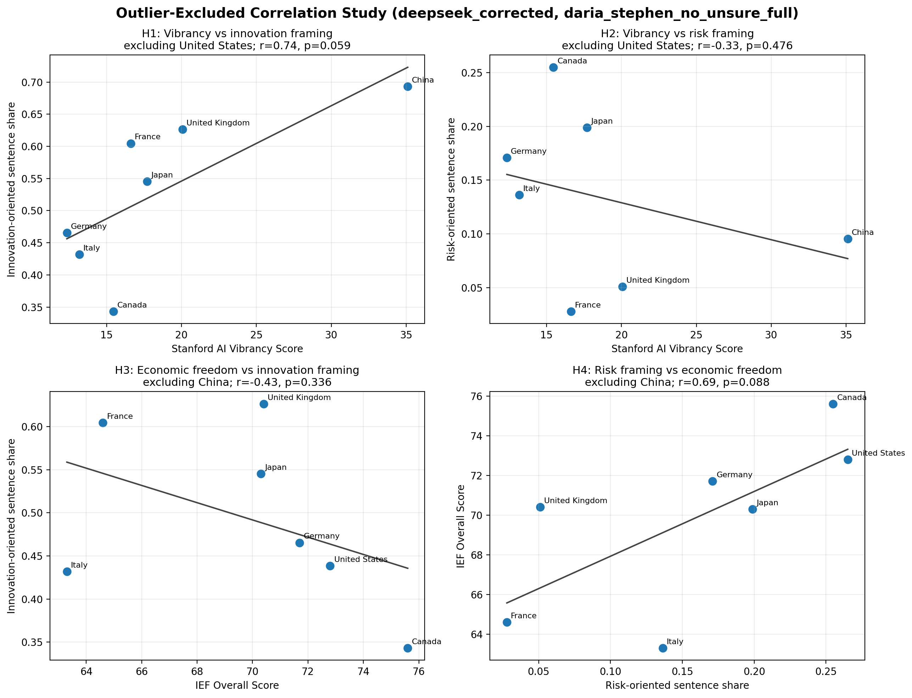
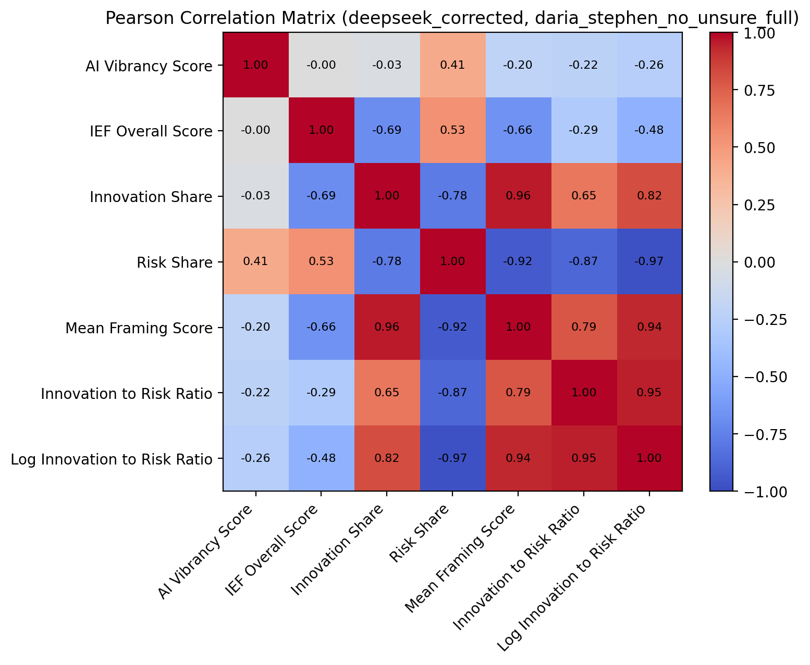
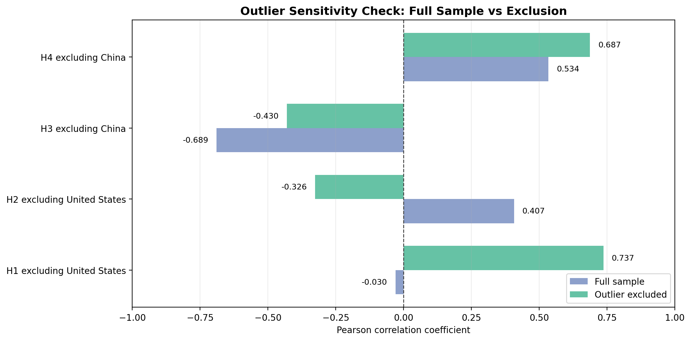

# AI-Policy

## Team Members
- Hayden Hubbard (@hatori27)
- Wu Cheng (@Nothingisavaliable)
- Daria (@complicatic)
- Sheena (@sheenapham1)
- Stephen (@St-ep-hen)

---

<!-- ## Research Question
How could the future of AI evolve? Much of this depends on if it is viewed as an opportunity or a danger. One perspective that has not been explored is the relationship between economic freedom and how AI is viewed and discussed. In more economically free countries, is AI innovation encouraged in glowing terms for the sake of the economy? On the other hand, in less economically free countries,  is more cautious terminology utilized to encourage confidence in a watchful government? Our research seeks to answer this question: __what relationship, if any, exists between economic freedom and AI regulatory rhetoric?__


---

## Data Sources


| Source | Description | URL |
|---|---|---|
| Google Drive source folder | National AI strategy PDF documents used for text analysis | [AI Policy PDFs](https://drive.google.com/drive/folders/1CCiBmppafwtXLRVTpnryIY8Y9PLvxwvG) |
| The Heritage Foundation | Economic Freedom Index scores and rankings across countries | [Economic Freedom Index](https://economicfreedom.heritage.org/pages/all-country-scores) |
| Freedom House | Global indicators of political rights and civil liberties | [Freedom in the World](https://freedomhouse.org/report/freedom-world) |
| V-Dem Institute | Democracy and institutional quality metrics | [V-Dem Dataset](https://www.v-dem.net/data/the-v-dem-dataset/) |
| Comparative Agendas Project (CAP) | Legislative and policy agenda datasets related to technology and AI regulation | [Comparative Agendas Project](https://www.comparativeagendas.net/) |

---

## Data Sources Details

- The Google Drive source folder provides the national AI strategy PDFs used for text extraction and framing analysis.
- The Heritage Foundation Index of Economic Freedom offers standardized measures of market openness and government intervention.
- Freedom House and V-Dem help control for political systems, institutional quality, and civil liberties.
- CAP provides legislative text and policy agenda information relevant to technology governance.

---

---
## Methodology

To investigate the relationship between economic freedom and AI regulatory rhetoric, this project will:

- Collect AI-related policy documents from the Google Drive source folder and obtain economic freedom indicators from the Heritage Foundation Index of Economic Freedom.

- Use OCR and natural language processing (NLP) techniques to extract and analyze AI policy rhetoric within G7 countries’ official policy documents.

- Identify recurring themes, sentiment, and regulatory framing regarding artificial intelligence.

- Compare differences in rhetoric across countries with varying levels of economic freedom.

- Analyze the relationship between Economic Freedom Index scores and AI policy rhetoric using:
  - Qualitative analysis (written interpretation, thematic analysis, and mind maps)
  - Quantitative analysis (correlation analysis and statistical comparison)

--- -->


## Background

Existing research has examined AI governance through various lenses; however, the relationship between economic freedom and AI-related policy discourse remains underexplored. This research seeks to address that gap by investigating whether a country’s level of economic freedom shapes how governments frame the development and regulation of AI within national strategy documents.

In particular, this study compares the G7 countries and China to analyze how different economic and political environments influence AI regulatory narratives, policy priorities, and governance orientations.

---

# Research Question

> How do variations in economic freedom and AI vibrancy  shape the dominant framing embedded in national discourse, and how do these relationships vary across G7 countries and  China?

---

# Hypotheses

## H1 — AI Vibrancy and Innovation-Oriented Rhetoric

Countries with higher Stanford AI Vibrancy scores will exhibit more innovation-enabling rhetoric in their national policy documents.

### Rationale
Countries with more developed AI ecosystems are expected to have stronger industry stakeholders and innovation-oriented policy agendas, encouraging governments to frame AI regulation in enabling rather than restrictive terms.

---

## H2 — AI Vibrancy and Risk-Oriented Rhetoric

Countries with lower Stanford AI Vibrancy scores will exhibit more risk-enabling rhetoric in their national policy documents.

### Rationale
Countries with less developed AI ecosystems are expected to have weaker industry stakeholders and risk-oriented policy agendas, encouraging governments to frame AI regulation in restrictive rather than enabling terms.

---

## H3 — Economic Freedom and Positive Regulatory Framing

Countries whose AI regulatory discourse is more positive and innovation-oriented will exhibit higher economic freedom scores.

### Rationale
Positive regulatory framing may reflect broader ideological commitments toward market liberalism and economic openness, which are captured by economic freedom indicators.

---

## H4 — Economic Freedom and Negative Regulatory Framing

Countries whose AI regulatory discourse is more negative and risk-oriented will exhibit lower economic freedom scores.

### Rationale
Negative regulatory framing may reflect broader ideological commitments away from market liberalism and economic openness, which are captured by economic freedom indicators.

---
## Data Sources

| Source | Description | URL / Reference |
| :--- | :--- | :--- |
| **National AI Strategy Documents** | National AI strategy PDF documents used for text analysis. | *Collected from available public websites* |
| **The Heritage Foundation** | Economic Freedom Index scores and rankings across countries. | [Economic Freedom Index](https://economicfreedom.heritage.org/pages/all-country-scores) |
| **Stanford HAI** | AI Index reports measuring global AI vibrancy across research, development, and economy. | [Stanford AI Index](https://hai.stanford.edu/ai-index) |

---

### Human Expert Labels

Human annotation is used to calibrate and audit the LLM labels. Experts (Daria and Stephen) established consensus and agreed on a random sample of 23 sentences extracted from the national strategy PDFs.

---

# Methodology

## AI Vibrancy

AI vibrancy is measured using the Stanford AI Index country-level AI Vibrancy scores for the G7 countries and China. The main country-level predictor is the **Total Score**, renamed in the analysis as `AI Vibrancy Score`. Component dimensions such as R&D, Responsible AI, Economy, Talent, Policy and Governance, Public Opinion, and Infrastructure are retained for descriptive analysis.

## Economic Freedom

Economic freedom is measured using the Heritage Foundation Index of Economic Freedom panel. The correlation study uses the latest available year, currently **2026**, and uses `Overall Score` as `IEF Overall Score`.

## Text Analysis

National AI strategy and regulatory documents from G7 countries, China, and the European Union are analyzed using sentence-level AI regulatory framing. English documents are used directly. Chinese-heavy texts are translated into English with `facebook/nllb-200-distilled-600M` or analyzed through an existing English analysis corpus where available.

The current text-analysis workflow uses **DeepSeek R1 14B through Ollama** for local sentence classification. Each sentence is classified independently into one of five labels:

| Label | Meaning |
|---|---|
| Innovation-oriented | Emphasizes innovation, investment, adoption, competitiveness, productivity, and flexible regulation |
| Risk-oriented | Emphasizes risk, safety, accountability, privacy, fairness, human rights, and regulatory obligations |
| Mixed | A single sentence contains both innovation and risk framing |
| Neutral | Descriptive, administrative, or procedural sentences |
| Unsure | Unclear residual category; excluded from the no-unsure human-gold calibration set |

The model prompt includes the project codebook and human-annotated gold examples. The model returns structured JSON with a label, confidence score, and reason. Both the raw model label and the final corrected label are retained for auditing.

## Human Calibration and Correction

The LLM labeling workflow is calibrated with human expert annotations rather than treated as a fully automatic black box. A sample of 40 sentences was independently annotated by multiple human annotators. Annotator 1 showed lower annotation stability, so the final calibration workflow uses the Daria + Stephen consensus labels.

Daria and Stephen agreed on 23 sentences. For the current `daria_stephen_no_unsure_full` run, human-gold `Unsure` labels are excluded, leaving **16 substantive gold labels** for few-shot examples, exact sentence overrides, and model evaluation. Raw DeepSeek accuracy on this usable gold set is **75%**; after exact human-gold overrides, corrected accuracy is **100%**. The full run applies **4 human overrides**.

Correction logic:

```text
corrected_label =
    human_gold_label, if the sentence is present in the usable human gold set
    model_label, otherwise
```

Country/entity framing summaries are computed from corrected labels. Innovation-oriented sentences score `+1`, risk-oriented sentences score `-1`, and mixed, neutral, and unsure sentences score `0` for the net framing measure. The main aggregate variables are `Innovation Share`, `Risk Share`, `Mean Framing Score`, and the smoothed `Innovation-to-Risk Ratio`.

---

# Correlation Analysis

Correlation analysis is conducted in `notebooks/Correlation Study/correlation_study.ipynb` to examine relationships between:

- Stanford AI Vibrancy scores and innovation-oriented framing
- Stanford AI Vibrancy scores and risk-oriented framing
- Economic Freedom scores and innovation-oriented framing
- Risk-oriented framing and Economic Freedom scores
- Combined AI Vibrancy + Economic Freedom predictors and the log innovation-to-risk framing ratio

The current notebook uses the corrected DeepSeek framing output by default: `outputs/deepseek_ai_framing_summary_corrected_daria_stephen_no_unsure_full.csv`. The European Union is included in descriptive framing summaries but excluded from the G7 + China correlation sample because comparable AI Vibrancy and IEF country scores are not used for it in this study.

Because the merged country-level sample has only eight observations, all correlation coefficients, regressions, and mediation diagnostics are interpreted as exploratory and directional rather than confirmatory.

---

# Expected Contribution

This research contributes to the emerging literature on AI governance by connecting political-economic structure with regulatory discourse.

Rather than treating AI policy solely as a technical or legal issue, this study examines how broader economic ideology may shape national narratives surrounding AI development and regulation.

---

# Core Analytical Logic

```text
AI Vibrancy
      ↓
Regulatory Framing
      ↓
Economic Freedom Orientation
```

This framework explores whether AI ecosystem maturity influences regulatory rhetoric, and whether that rhetoric reflects broader economic and ideological preferences.

# Preliminary Results

## Stanford AI Vibrancy Tool — G7 + China

Cross-country comparison of AI vibrancy scores (Total Score and 7 sub-dimensions: R&D, Responsible AI, Economy, Talent, Policy and Governance, Public Opinion, Infrastructure).

<p align="center">
  
</p>

<p align="center">
  
</p>

**Key observations**:
- The United States leads overall (Total Score ≈ 77.85), driven primarily by Responsible AI, Economy, and Infrastructure.
- China ranks second (≈ 35.10) — its R&D score is essentially tied with the U.S., but it lags substantially in Responsible AI, Economy, and Policy & Governance.
- The remaining G7 countries cluster between 12 and 21, with no single G7 member dominating.
- The component radar chart highlights how each country’s AI vibrancy profile differs across R&D, Responsible AI, Economy, Talent, Policy and Governance, Public Opinion, and Infrastructure.

## Index of Economic Freedom — G7 + China

Heritage Foundation Economic Freedom scores for the same eight countries, used as the political-economic context for the framing analysis.

<p align="center">
  
</p>

<p align="center">
  
</p>

**Key observations**:
- G7 economies generally cluster in the "Mostly Free" / "Moderately Free" range.
- China sits noticeably below the G7, providing a natural contrast for testing whether economic freedom levels relate to AI regulatory framing.
- The yearly trend chart shows how economic freedom scores change over time, providing temporal context for the cross-sectional comparison.


## DeepSeek Corrected Innovation vs. Risk Framing

The corrected DeepSeek sentence-level classifier labels each policy sentence as innovation-oriented, risk-oriented, mixed, neutral, or unsure. Innovation-oriented sentences emphasize adoption, investment, productivity, competitiveness, regulatory flexibility, and deployment. Risk-oriented sentences emphasize safety, accountability, privacy, fairness, rights protection, regulatory obligations, and precaution.

Representative corrected label examples:

| Country/entity | Corrected label | Sentence excerpt |
|---|---|---|
| Canada | Innovation-oriented | "AI can unlock capabilities beyond human limits, opening doors to new ways of working and operating." |
| Canada | Risk-oriented | "For greater data security and privacy, CANChat ensures that all data is safeguarded and stored in Canada, and that prompts are not used to train its AI." |
| European Union | Mixed | "122 The ‘ecosystem of trust’ focuses on measures to ensure that AI is developed in an ethical manner; the ‘ecosystem of excellence’ focuses on measures to promote responsible investment, innovation and implementation of AI." |
| France | Neutral | "Members include Ed Tech and universities such as Rennes, Haute-Alsace, Paris-Est Créteil, Bordeaux Montaigne, Nîmes, Montpellier, and the National Conservatory of Arts and Crafts." |

The current corrected full run contains **3,730 sentences** across nine countries/entities, including the European Union for descriptive framing analysis. The strongest positive mean framing scores are France (`0.577`), the United Kingdom (`0.575`), and China (`0.598`). Canada (`0.088`) and the United States (`0.173`) show the lowest mean framing scores in the corrected summary.

<p align="center">
  
</p>

Outputs are saved in `outputs/deepseek_ai_framing_sentence_labels_raw_daria_stephen_no_unsure_full.csv`, `outputs/deepseek_ai_framing_sentence_labels_corrected_daria_stephen_no_unsure_full.csv`, `outputs/deepseek_ai_framing_summary_corrected_daria_stephen_no_unsure_full.csv`, `outputs/deepseek_ai_framing_gold_metrics_daria_stephen_no_unsure_full.csv`, and `outputs/deepseek_ai_framing_gold_confusion_daria_stephen_no_unsure_full.csv`.

These corrected outputs provide the empirical anchor for H1-H4 by translating sentence-level regulatory discourse into country/entity-level innovation and risk framing measures.

## Correlation Study — Vibrancy, Economic Freedom, and Framing

The correlation study combines Stanford AI Vibrancy scores, 2026 Heritage Index of Economic Freedom scores, and corrected DeepSeek framing results for the same G7 + China country set. The main hypothesis tests use `Innovation Share` and `Risk Share`; robustness checks use `Mean Framing Score` and the log smoothed innovation-to-risk ratio.

<p align="center">
  
</p>

<p align="center">
  
</p>

<p align="center">
  
</p>

<p align="center">
  
</p>

**Current exploratory results using corrected DeepSeek framing**:
- H1 expects AI Vibrancy to be positively associated with `Innovation Share`, but the current Pearson correlation is near zero and slightly negative (`r = -0.030`, `p = 0.9429`). Directional support is not observed.
- H2 expects lower AI Vibrancy to be associated with higher `Risk Share`, but the observed AI Vibrancy to Risk Share correlation is positive (`r = 0.407`, `p = 0.3172`). Directional support is not observed.
- H3 expects higher IEF scores to be associated with higher `Innovation Share`, but the observed relationship is negative (`r = -0.689`, `p = 0.0589`). Directional support is not observed.
- H4 expects `Risk Share` to be negatively associated with IEF, but the observed relationship is positive (`r = 0.534`, `p = 0.1728`). Directional support is not observed.
- Robustness checks using the log innovation-to-risk ratio also do not support the expected positive relationships with AI Vibrancy (`r = -0.264`, `p = 0.5280`) or IEF (`r = -0.478`, `p = 0.2312`).
- The combined model predicting log innovation-to-risk ratio from AI Vibrancy and IEF has `R2 = 0.298`, but with only eight observations it should be interpreted as a descriptive diagnostic.
- The mediation diagnostic is retained as a mechanism check, not a formal causal test.

**Outlier sensitivity rationale**:
- The **United States** is evaluated as a sensitivity case for H1/H2 because it is by far the highest-AI-vibrancy country, yet its corrected framing is comparatively risk-conscious. It therefore has high leverage in tests linking AI ecosystem capacity to innovation- or risk-oriented rhetoric.
- **China** is evaluated as a sensitivity case for H3/H4 because it has the lowest IEF score in the sample but one of the strongest innovation-oriented framing profiles. It represents a state-led innovation case that can strongly affect tests linking economic freedom to regulatory framing.
- These exclusions are diagnostic rather than preferred specifications. The full G7 + China sample remains the main result; the outlier checks show how sensitive the correlations are to theoretically unusual cases.

With the United States excluded, H1 changes from no relationship to a strong positive association between AI Vibrancy and Innovation Share (`r = 0.737`, `p = 0.0586`; Spearman `rho = 0.821`, `p = 0.0234`). H2 also flips into the expected negative direction, although weakly (`r = -0.326`, `p = 0.4757`). With China excluded, H3 remains negative but weaker (`r = -0.430`, `p = 0.3357`), and H4 remains opposite to expectation (`r = 0.687`, `p = 0.0880`).

Key outputs are saved in `outputs/correlation_study_dataset_deepseek_corrected_daria_stephen_no_unsure_full.csv`, `outputs/correlation_study_correlations_deepseek_corrected_daria_stephen_no_unsure_full.csv`, `outputs/correlation_study_outlier_sensitivity_deepseek_corrected_daria_stephen_no_unsure_full.csv`, `outputs/correlation_study_regression_models_deepseek_corrected_daria_stephen_no_unsure_full.csv`, and `outputs/correlation_study_mediation_deepseek_corrected_daria_stephen_no_unsure_full.csv`.

---

# Discussion

## Result Interpretations

### AI Vibrancy (H1 & H2)

While the full sample initially showed no support for our hypotheses, an outlier check reveals that the original theories hold true for the majority of the sample. When the United States is excluded, countries with higher AI vibrancy behave exactly as expected: they focus significantly more on innovation (r=0.737) and less on risk (r=−0.326).

The fact that the full sample originally flipped is entirely due to the unique position of the US. Because its AI infrastructure is so highly developed, the US faces immediate real-world pressures—such as public scrutiny and lawsuits over privacy, intellectual property, and labor impacts. This forces the US to write highly cautious, problem-solving documents. Meanwhile, nations with lower AI indices are still in an earlier adoption phase, allowing them to use broader, innovation-enabling language to push for public acceptance.

### Economic Freedom (H3 & H4)

Initial hypotheses predicted that countries with higher economic freedom would feature more innovation-oriented rhetoric. However, our full analysis inverted this assumption and the unexpected trend remains even when China is removed from the dataset. This suggests the results are driven by a deeper structural difference in how governments approach market intervention.

In countries with higher economic freedom scores (such as the US and Canada), the state primarily acts as a regulatory referee. Because they rely on the private sector to drive technological advancement, their national policies focus heavily on defining legal boundaries, protecting individual rights, and setting safety guardrails - resulting in more risk-oriented text. Conversely, in systems with lower economic freedom scores (ranging from European nations with more state-directed industrial policies to an authoritarian state like China) the government takes a more active role in managing economic growth. In these cases, national policies serve as top-down promotional blueprints designed to mandate development, rally funding, and maximize competitiveness, which keeps the language focused heavily on innovation.

## Limitations - Sheena


## Directions for Future Research

---

## Folder Structure

```text
AI-Policy/
├── data/                                      # Source data and processed intermediate datasets
│   ├── AI vibrancy tool screen shot/          # Stanford AI Vibrancy source screenshots and cleaned country scores
│   ├── Human expert framing labels/           # Human annotation materials for calibrating LLM sentence labels
│   ├── Index of Economic Freedom/             # Raw Heritage Foundation IEF country files
│   ├── number/                                # Numeric datasets used for AI development and economic analysis
│   └── pdf/
│       └── AI Policy/                         # National AI strategy / AI policy document corpus
│           ├── *_National_AI_Strategy*.pdf    # G7 + China source policy PDFs
│           ├── EU_AI_Strategy.pdf             # EU benchmark policy document for descriptive framing analysis
│           ├── 国务院关于深入实施“人工智能+”行动的意见.pdf
│           ├── _extracted/                    # Extracted English text and document-level diagnostics
│           └── _translated_nllb/              # NLLB translations for Chinese-heavy texts
│
├── notebooks/                                 # Reproducible analysis notebooks
│   ├── AI Development/
│   │   ├── select_g7_china_data.ipynb         # Finds Stanford AI Index CSVs with G7 + China coverage
│   │   ├── ai_vibrancy_tool.ipynb             # Cleans, summarizes, and visualizes Stanford AI Vibrancy scores
│   │   └── ai_dev_index_v2.ipynb              # Builds an exploratory composite AI development index
│   ├── Economic Freedom/
│   │   └── ief_g7_china_analysis.ipynb        # Builds the IEF panel and saves IEF visualizations
│   ├── Text Analysis/
│   │   ├── national_ai_strategy_nllb_translation.ipynb
│   │   │                                      # Extracts/translates policy text into the English analysis corpus
│   │   ├── human_expert_framing_labels_analysis.ipynb
│   │   │                                      # Processes human annotation agreement and gold labels
│   │   └── LLM_based_text_framing_analysis.ipynb
│   │                                          # Runs DeepSeek sentence labeling, human correction, and framing plots
│   └── Correlation Study/
│       └── correlation_study.ipynb            # Merges AI Vibrancy, IEF, and corrected framing for H1-H4 tests
│
├── src/                                       # Shared Python helper modules used by notebooks
│   ├── common.py                              # Country lists, colors, document mappings, repo-root helper
│   ├── data_utils.py                          # CSV loading, country extraction, markdown summary helpers
│   ├── ai_index.py                            # Score normalization and weighted composite index helpers
│   ├── stats.py                               # Descriptive statistics helper
│   ├── text_utils.py                          # PDF extraction, sentence splitting, translation utilities
│   ├── human_framing.py                       # Human annotation loading and agreement processing
│   └── llm_framing.py                         # DeepSeek/Ollama prompt, parsing, correction, and summary logic
│
├── outputs/                                   # Generated tables, figures, and report artifacts
│
├── tests/                                     # Lightweight regression tests and legacy test scaffolding
├── PolicyBrief.md                             # Policy-facing written summary draft
├── README.md                                  # Project overview, methodology, results, and file guide
├── README.pdf                                 # PDF export of the README/report
└── LICENSE
```

### Key Structure Notes

`data/` contains both raw evidence and processed intermediate data. The most important reproducibility inputs are `ai_country_scores.csv` for AI Vibrancy, `ief_g7_china_panel.csv` for economic freedom, the AI policy PDFs under `data/pdf/AI Policy/`, and the human agreement files under `data/Human expert framing labels/processed_data/`.

`notebooks/` is organized by analytical stage. Run the AI Development and Economic Freedom notebooks to regenerate numeric predictors and README figures; run the Text Analysis notebooks to regenerate translated/extracted text, human-gold calibration files, and DeepSeek framing outputs; run `correlation_study.ipynb` last to rebuild the merged H1-H4 dataset, correlation tables, models, and final correlation figures.

`src/` holds shared helper code now imported directly from the flat `src` directory. The most important modules are `llm_framing.py` for local DeepSeek sentence classification and correction, `human_framing.py` for processing expert annotations, and `data_utils.py` / `common.py` for cross-notebook data handling.

`outputs/` contains generated artifacts rather than hand-edited source data. The DeepSeek files preserve the raw model labels, corrected sentence labels, human-gold diagnostics, and country-level framing summaries. The correlation files preserve the exact merged dataset and statistical outputs used in the README.
