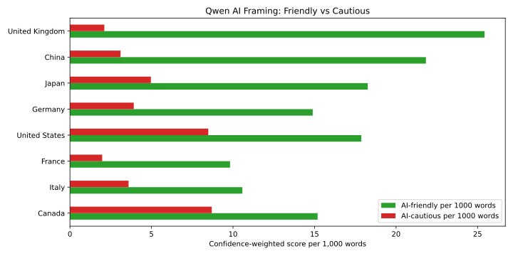
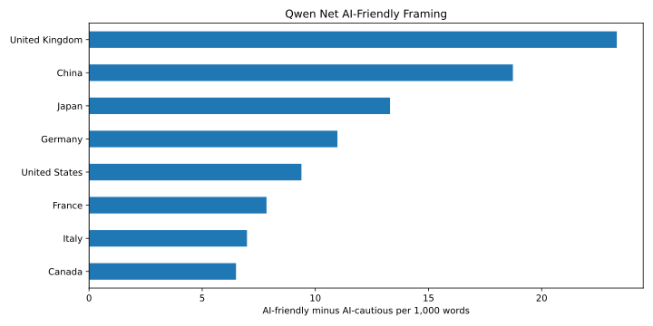
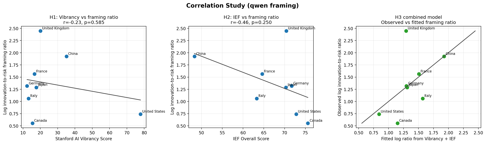
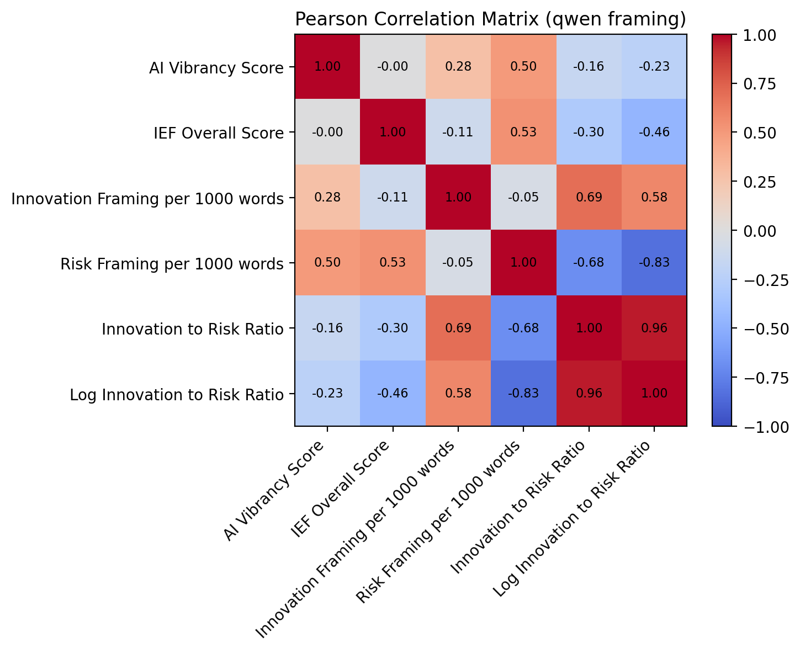

# AI-Policy

## Team Members
- Hayden Hubbard (@hatori27)
- Wu Cheng (@Nothingisavaliable)
- Daria (@complicatic)
- Sheena (@sheenapham1)
- Stephen (@St-ep-hen)

---

<!-- ## Research Question
How could the future of AI evolve? Much of this depends on if it is viewed as an opportunity or a danger. One perspective that has not been explored is the relationship between economic freedom and how AI is viewed and discussed. In more economically free countries, is AI innovation encouraged in glowing terms for the sake of the economy? On the other hand, in less economically free countries,  is more cautious terminology utilized to encourage confidence in a watchful government? Our research seeks to answer this question: __what relationship, if any, exists between economic freedom and AI regulatory rhetoric?__


---

## Data Sources


| Source | Description | URL |
|---|---|---|
| Google Drive source folder | National AI strategy PDF documents used for text analysis | [AI Policy PDFs](https://drive.google.com/drive/folders/1CCiBmppafwtXLRVTpnryIY8Y9PLvxwvG) |
| The Heritage Foundation | Economic Freedom Index scores and rankings across countries | [Economic Freedom Index](https://economicfreedom.heritage.org/pages/all-country-scores) |
| Freedom House | Global indicators of political rights and civil liberties | [Freedom in the World](https://freedomhouse.org/report/freedom-world) |
| V-Dem Institute | Democracy and institutional quality metrics | [V-Dem Dataset](https://www.v-dem.net/data/the-v-dem-dataset/) |
| Comparative Agendas Project (CAP) | Legislative and policy agenda datasets related to technology and AI regulation | [Comparative Agendas Project](https://www.comparativeagendas.net/) |

---

## Data Sources Details

- The Google Drive source folder provides the national AI strategy PDFs used for text extraction and framing analysis.
- The Heritage Foundation Index of Economic Freedom offers standardized measures of market openness and government intervention.
- Freedom House and V-Dem help control for political systems, institutional quality, and civil liberties.
- CAP provides legislative text and policy agenda information relevant to technology governance.

---

## Methodology

To investigate the relationship between economic freedom and AI regulatory rhetoric, this project will:

- Collect AI-related policy documents from the Google Drive source folder and obtain economic freedom indicators from the Heritage Foundation Index of Economic Freedom.

- Use OCR and natural language processing (NLP) techniques to extract and analyze AI policy rhetoric within G7 countries’ official policy documents.

- Identify recurring themes, sentiment, and regulatory framing regarding artificial intelligence.

- Compare differences in rhetoric across countries with varying levels of economic freedom.

- Analyze the relationship between Economic Freedom Index scores and AI policy rhetoric using:
  - Qualitative analysis (written interpretation, thematic analysis, and mind maps)
  - Quantitative analysis (correlation analysis and statistical comparison)

--- -->


## Background

Existing research has examined AI governance through various lenses; however, the relationship between economic freedom and AI-related policy discourse remains underexplored. This research seeks to address that gap by investigating whether a country’s level of economic freedom shapes how governments frame the development and regulation of AI within national strategy documents.

In particular, this study compares the G7 countries and China to analyze how different economic and political environments influence AI regulatory narratives, policy priorities, and governance orientations.

---

# Research Question

## Primary Research Question

> How do variations in economic freedom and AI vibrancy  shape the dominant framing embedded in national discourse, and how do these relationships vary across G7 countries and  China?

---

# Hypotheses

## H1 — AI Vibrancy and Innovation-Oriented Rhetoric

Countries with higher Stanford AI Vibrancy scores will exhibit more innovation-enabling rhetoric in their national policy documents.

### Rationale
Countries with more developed AI ecosystems are expected to have stronger industry stakeholders and innovation-oriented policy agendas, encouraging governments to frame AI regulation in enabling rather than restrictive terms.

---

## H2 — AI Vibrancy and Risk-Oriented Rhetoric

Countries with lower Stanford AI Vibrancy scores will exhibit more risk-enabling rhetoric in their national policy documents.

### Rationale
Countries with less developed AI ecosystems are expected to have weaker industry stakeholders and risk-oriented policy agendas, encouraging governments to frame AI regulation in restrictive rather than enabling terms.

---

## H3 — Economic Freedom and Positive Regulatory Framing

Countries whose AI regulatory discourse is more positive and innovation-oriented will exhibit higher economic freedom scores.

### Rationale
Positive regulatory framing may reflect broader ideological commitments toward market liberalism and economic openness, which are captured by economic freedom indicators.

---

## H4 — Economic Freedom and Negative Regulatory Framing

Countries whose AI regulatory discourse is more negative and risk-oriented will exhibit lower economic freedom scores.

### Rationale
Negative regulatory framing may reflect broader ideological commitments away from market liberalism and economic openness, which are captured by economic freedom indicators.

---

# Methodology

## Text Analysis

National AI strategy and regulatory documents from G7 countries, China, and the European Union will be collected and analyzed using Qwen sentence-level framing.

The analysis estimates the relative emphasis placed on AI-friendly versus AI-cautious discourse. AI-friendly framing includes language about innovation, adoption, investment, productivity, competitiveness, regulatory flexibility, and reduced regulatory burdens. AI-cautious framing includes language about risk, safety, oversight, compliance, accountability, privacy, fairness, rights protection, and precaution.

China is treated as one country-level case and combines both the national AI strategy document and the newer State Council “AI+” action policy. Each country/entity receives confidence-weighted framing scores normalized per 1,000 words.

For consistency, framing analysis uses an English analysis corpus. Chinese-heavy text is translated into English with `facebook/nllb-200-distilled-600M`; English source documents are used directly.

---

# Correlation Analysis

Correlation analysis is conducted in `notebooks/Correlation Study/correlation_study.ipynb` to examine relationships between:

- 📈 Economic Freedom scores and regulatory framing scores
- 🤖 Stanford AI Vibrancy scores and regulatory framing scores
- 🧩 Combined AI Vibrancy + Economic Freedom predictors and the innovation-to-risk framing ratio

The core dependent variable is the **Innovation-to-Risk Framing Ratio**, calculated as the ratio of Qwen-classified AI-friendly framing to Qwen-classified AI-cautious framing. The notebook uses the Qwen framing output by default and stores a merged cross-country dataset, correlation table, regression models, mediation diagnostic, and visual summaries in `outputs/`.

---

# Expected Contribution

This research contributes to the emerging literature on AI governance by connecting political-economic structure with regulatory discourse.

Rather than treating AI policy solely as a technical or legal issue, this study examines how broader economic ideology may shape national narratives surrounding AI development and regulation.

---

# Core Analytical Logic

```text
AI Vibrancy
      ↓
Regulatory Framing
      ↓
Economic Freedom Orientation
```

This framework explores whether AI ecosystem maturity influences regulatory rhetoric, and whether that rhetoric reflects broader economic and ideological preferences.

# Preliminary Results

## Stanford AI Vibrancy Tool — G7 + China

Cross-country comparison of AI vibrancy scores (Total Score and 7 sub-dimensions: R&D, Responsible AI, Economy, Talent, Policy and Governance, Public Opinion, Infrastructure).


**Key observations**:
- The United States leads overall (Total Score ≈ 77.85), driven primarily by Responsible AI, Economy, and Infrastructure.
- China ranks second (≈ 35.10) — its R&D score is essentially tied with the U.S., but it lags substantially in Responsible AI, Economy, and Policy & Governance.
- The remaining G7 countries cluster between 12 and 21, with no single G7 member dominating.
- The component radar chart highlights how each country’s AI vibrancy profile differs across R&D, Responsible AI, Economy, Talent, Policy and Governance, Public Opinion, and Infrastructure.

## Index of Economic Freedom — G7 + China

Heritage Foundation Economic Freedom scores for the same eight countries, used as the political-economic context for the framing analysis.


**Key observations**:
- G7 economies generally cluster in the "Mostly Free" / "Moderately Free" range.
- China sits noticeably below the G7, providing a natural contrast for testing whether economic freedom levels relate to AI regulatory framing.
- The yearly trend chart shows how economic freedom scores change over time, providing temporal context for the cross-sectional comparison.

## Descriptive Statistics — Key Numeric Variables

To address the feedback, the project now explicitly reports standard descriptive statistics for the main numeric variables. The tables below report count, mean, median, standard deviation, minimum, and maximum for the Heritage Index of Economic Freedom scores and Stanford AI Vibrancy metrics.

**Index of Economic Freedom**

| Variable | count | mean | median | stdev | min | max |
| --- | --- | --- | --- | --- | --- | --- |
| Overall Score | 256 | 68.48 | 70.3 | 8.49 | 48.0 | 81.2 |
| Property Rights | 256 | 77.09 | 85.95 | 20.04 | 20.0 | 96.2 |
| Government Integrity | 256 | 70.47 | 76.0 | 17.9 | 22.0 | 95.1 |
| Judicial Effectiveness | 80 | 76.22 | 76.8 | 14.36 | 37.4 | 97.9 |
| Tax Burden | 256 | 61.41 | 62.35 | 10.62 | 33.2 | 80.0 |
| Government Spending | 256 | 43.14 | 43.95 | 22.77 | 0.0 | 95.9 |
| Fiscal Health | 80 | 48.77 | 54.55 | 30.69 | 0.0 | 92.9 |
| Business Freedom | 256 | 79.47 | 83.5 | 11.59 | 43.1 | 100.0 |
| Labor Freedom | 176 | 67.27 | 68.05 | 14.97 | 39.9 | 98.5 |
| Monetary Freedom | 256 | 81.03 | 81.5 | 5.96 | 61.5 | 94.3 |
| Trade Freedom | 256 | 79.42 | 80.8 | 9.94 | 20.0 | 88.8 |
| Investment Freedom | 256 | 66.19 | 70.0 | 18.3 | 20.0 | 90.0 |
| Financial Freedom | 256 | 63.12 | 70.0 | 17.72 | 20.0 | 90.0 |

**Stanford AI Vibrancy**

| Variable | count | mean | median | stdev | min | max |
| --- | --- | --- | --- | --- | --- | --- |
| Total Score | 8 | 26.04 | 17.16 | 22.12 | 12.35 | 77.85 |
| R&D | 8 | 2.99 | 0.9 | 4.08 | 0.41 | 9.61 |
| Responsible AI | 8 | 3.26 | 1.3 | 4.77 | 0.49 | 14.29 |
| Economy | 8 | 2.35 | 0.57 | 4.84 | 0.15 | 14.29 |
| Talent | 8 | 4.94 | 4.63 | 1.46 | 3.35 | 7.72 |
| Policy and Governance | 8 | 3.31 | 2.29 | 3.24 | 0.53 | 9.71 |
| Public Opinion | 8 | 4.18 | 3.22 | 2.73 | 0.61 | 8.44 |
| Infrastructure | 8 | 5.01 | 4.03 | 3.89 | 1.67 | 13.85 |

The CSV versions are saved in `outputs/descriptive_statistics_ief.csv`, `outputs/descriptive_statistics_ai_vibrancy.csv`, and `outputs/descriptive_statistics_key_numeric_variables.csv`.

## Qwen AI-Friendly vs. AI-Cautious Framing

The Qwen sentence-level classifier labels each policy sentence as AI-friendly, AI-cautious, mixed, or neutral. AI-friendly sentences emphasize innovation, adoption, investment, productivity, competitiveness, regulatory flexibility, or faster deployment. AI-cautious sentences emphasize risk, safety, oversight, compliance, accountability, privacy, fairness, rights protection, or precaution. Mixed sentences contribute half of their confidence score to each side, and neutral sentences contribute zero.





Outputs are saved in `outputs/qwen_ai_framing_summary.csv`, `outputs/qwen_ai_framing_sentence_labels.csv`, `outputs/qwen_g7_china_framing_table.csv`, and `outputs/qwen_ai_framing_overview.md`.

These visualizations together provide the empirical anchor for the hypotheses (H1–H3): the variation in AI vibrancy, economic freedom, and regulatory framing across the analyzed jurisdictions is large enough to test whether broader political-economic and AI ecosystem conditions predict the framing of national AI strategies.

## Correlation Study — Vibrancy, Economic Freedom, and Framing

The correlation study combines Stanford AI Vibrancy scores, 2026 Heritage Index of Economic Freedom scores, and the Qwen framing results for the same G7 + China country set. The main framing variable is the log innovation-to-risk ratio, derived from Qwen AI-friendly framing per 1,000 words divided by Qwen AI-cautious framing per 1,000 words.





**Initial exploratory results (TO BE CHANGED)**:
- H1 shows a weak negative relationship between AI Vibrancy and the Qwen log innovation-to-risk framing ratio (`Pearson r = -0.229`, `p = 0.5853`).
- H2 shows a negative relationship between IEF score and the Qwen log innovation-to-risk framing ratio (`Pearson r = -0.461`, `p = 0.2504`), so the current G7 + China sample does not support the expected positive direction.
- The combined model using AI Vibrancy and IEF explains more variation than AI Vibrancy alone (`R2 = 0.265` versus `R2 = 0.052`), but with only eight countries the results should be treated as exploratory rather than confirmatory.
- The mediation diagnostic is included as a mechanism check, not a formal causal test, because the sample size is too small for strong inference.

Key outputs are saved in `outputs/correlation_study_dataset_qwen.csv`, `outputs/correlation_study_correlations_qwen.csv`, `outputs/correlation_study_regression_models_qwen.csv`, and `outputs/correlation_study_mediation_qwen.csv`.

---

## Folder Structure

```text
AI-Policy/
├── data/
│   ├── AI vibrancy tool screen shot/
│   │   ├── ai_country_scores.csv
│   │   ├── ai_country_scores_long.csv
│   │   └── *.png                         # Stanford AI Vibrancy source screenshots
│   ├── Index of Economic Freedom/
│   │   ├── G7+China All Data
│   │   └── country-level IEF files
│   ├── number/
│   │   ├── ai_dev_index_g7_china.csv
│   │   ├── g7_china_datasets.csv
│   │   ├── ief_g7_china_panel.csv
│   │   └── PUBLIC DATA_ 2026 AI INDEX REPORT/
│   └── pdf/
│       └── AI Policy/
│           ├── CA_National_AI_Strategy.pdf
│           ├── CA_National_AI_Strategy_ocr.pdf
│           ├── CN_National_AI_Strategy.pdf
│           ├── DE_National_AI_Strategy.pdf
│           ├── EU_AI_Strategy.pdf
│           ├── FR__National_AI_Strategy.pdf
│           ├── IT_National_AI_Strategy.pdf
│           ├── JP_National_AI_Strategy.pdf
│           ├── JP_National_AI_Strategy_ocr.pdf
│           ├── UK_National_AI_Strategy.pdf
│           ├── UK_National_AI_Strategy_ocr.pdf
│           ├── US_National_AI_Strategy.pdf
│           ├── 国务院关于深入实施“人工智能+”行动的意见.pdf
│           ├── _extracted/
│           │   ├── *.txt                 # Extracted strategy text by country/entity
│           │   ├── document_sources.csv
│           │   ├── document_stats.csv
│           │   ├── theme_counts_raw.csv
│           │   ├── theme_per_1000_words.csv
│           │   ├── framing_keyword_counts.csv
│           │   ├── framing_category_counts.csv
│           │   ├── framing_scores_per_1000_words.csv
│           │   ├── framing_share_of_mentions.csv
│           │   ├── keyword_sentence_matches.csv
│           │   └── similarity_matrix.csv
│           └── _translated_nllb/
│               ├── China.txt             # NLLB English translation for Chinese-heavy policy text
│               └── translation_stats.csv
│
├── notebooks/
│   ├── AI Development/
│   │   ├── ai_vibrancy_tool.ipynb
│   │   ├── ai_dev_index_v2.ipynb
│   │   └── select_g7_china_data.ipynb
│   ├── Correlation Study/
│   │   └── correlation_study.ipynb
│   ├── Economic Freedom/
│   │   └── ief_g7_china_analysis.ipynb
│   └── Text Analysis/
│       ├── national_ai_strategy_nllb_translation.ipynb
│       ├── national_ai_strategy_text_analysis.ipynb
│       └── qwen_ai_framing.ipynb
│
├── outputs/
│   ├── stanford_AI_Vibrancy.png
│   ├── stanford_AI_Vibrancy_component_radar.png
│   ├── IEF_score.png
│   ├── IEF_score_by_year.png
│   ├── qwen_ai_framing_summary.csv
│   ├── qwen_ai_framing_sentence_labels.csv
│   ├── correlation_study_dataset_qwen.csv
│   ├── correlation_study_correlations_qwen.csv
│   ├── correlation_study_regression_models_qwen.csv
│   ├── correlation_study_mediation_qwen.csv
│   ├── correlation_study_scatter_qwen.png
│   └── correlation_study_matrix_qwen.png
│
├── README.md
├── README.pdf
└── LICENSE
```
